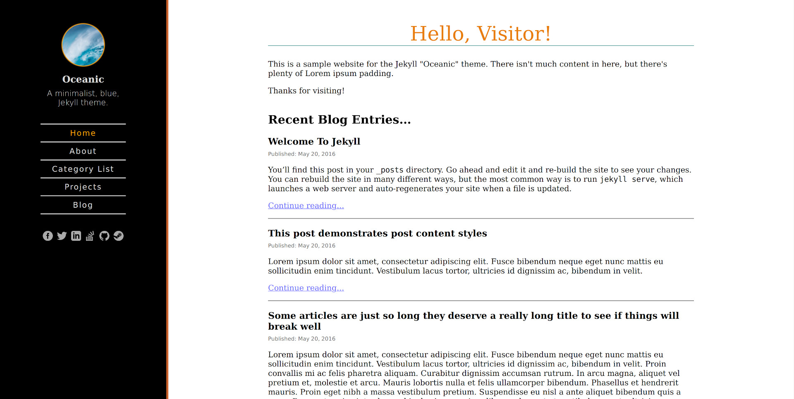

# Skinning Guide

The Oceanic template has limited support for skinning. If you wish to customize
the colors of the theme, but like the layout, you can provide a "skin" that
the template will use as an alternative.

Please note that creating skins requires a knowledge of
[Cascading Stylesheets (CSS)](https://en.wikipedia.org/wiki/Cascading_Style_Sheets)
and [Sass](https://sass-lang.com/). If you do not know these things, I cannot
help you.

## Creating a Skin

To create a skin, copy the file `_sass/skins/default.scss` and paste it into
your websites `_sass/skins` directory with a new name, such as `black.scss`.

Once you have done that, you can open `black.scss` and edit the SASS
properties to specify different colors, fonts, and other styles.

    /**********************************************************************/
    /* Fonts                                                              */
    /**********************************************************************/

    $default-font: serif;
    $site-title-font: serif;
    $header-font: sans-serif;
    $aside-font: sans-serif;
    $code-font: monospace;
    $table-header-font: serif;
    $table-cell-font: sans-serif;

    /**********************************************************************/
    /* Header                                                             */
    /**********************************************************************/

    $body-background: #000;
    $header-seam: 5px solid #CC622B;
    $avatar-aura-color: #FFA81C;
    $header-text-color: #DDD;
    $subtitle-font-weight: 300;
    $selected-navigation-color: #FFA200;
    $header-separator: 2px solid #DDD;
    $social-media-icon-color: #AAA;
    $hamburger-menu-color: #BBB;

    /**********************************************************************/
    /* Content Area                                                       */
    /**********************************************************************/

    $title-color: #E87C0C;
    $title-underline-color: #01807B;
    $text-color: #000;
    $heading-color: #000;
    $link-unvisited-color: #33F;
    $link-visited-color: #66F;
    $table-border-style: 3px solid #BBB;
    $table-cell-border-style: 1px solid #BBB;

## Enabling the Skin

Once you have created your skin, you can tell the template to use it by setting
the configuration setting in `_config.yml`:

    oceanic:
      skin: black

If successfull, the colouring should change:

## Syntax Highlighting Skins

The syntax highlighting used for code snippets can be changed the same way.

Since Jekyll supports [Rouge](http://rouge.jneen.net/) for syntax highlighting,
we can use any of the various Rouge/Pygments CSS themes that are available. A
list can be found [here](https://github.com/richleland/pygments-css). Once
you've chosen a CSS file and downloaded it (or created your own), put it into
`_sass/code-skins/` with the .scss file extension and you can then set it via
`_config.yml` the same way as for a regular skin:

    oceanic:
      code-skin: zenburn  # Use _sass/code-skins/zenburn.scss
